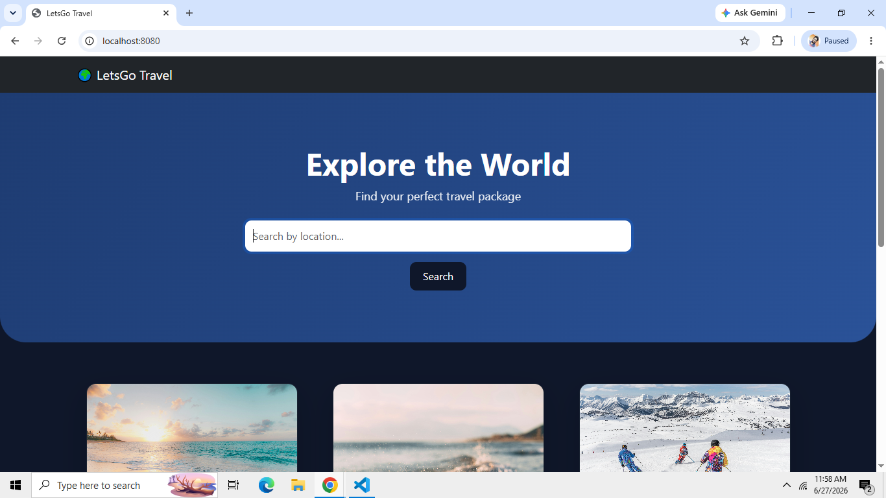
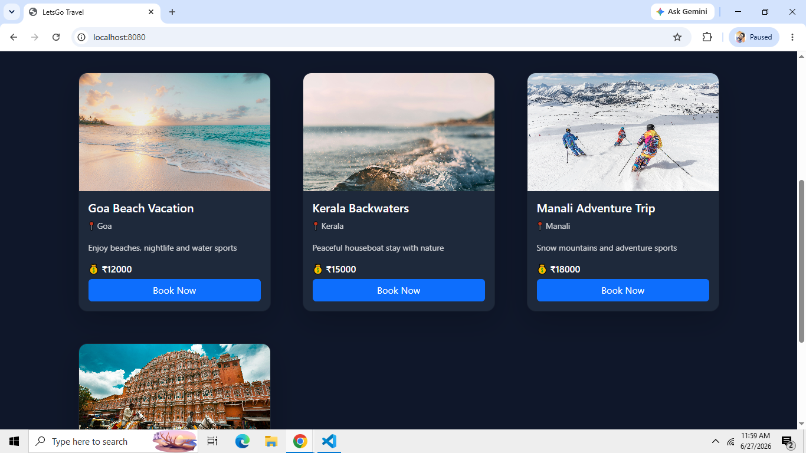
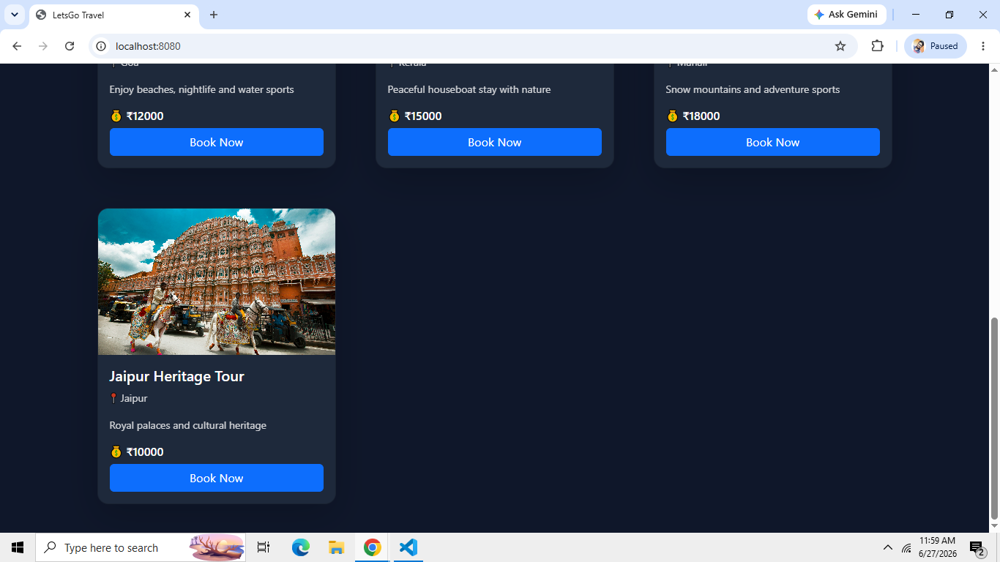
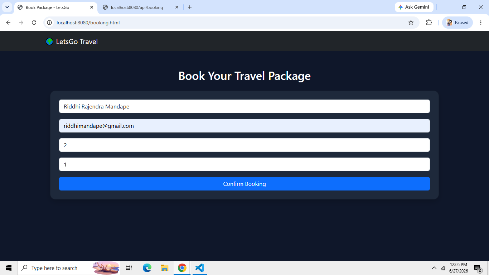
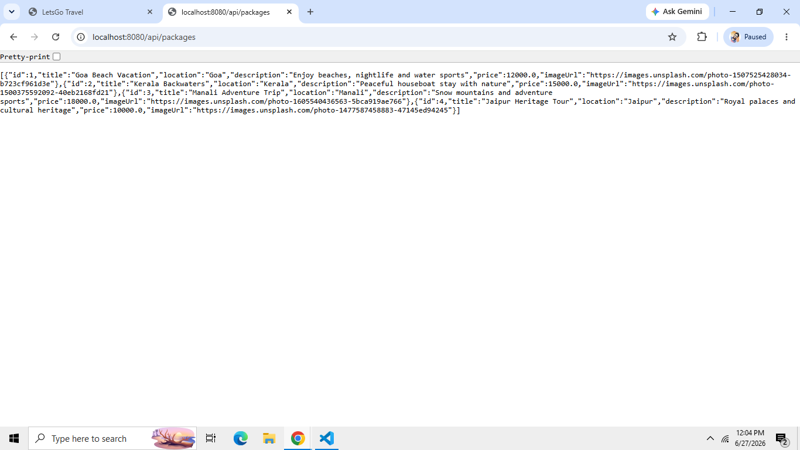

Travel Booking Web App - Spring Boot + JS (Phase 1)

Features :
- REST APIs built using Spring Boot
- CRUD operations for Tour Packages
- Booking system with API integration
- Spring Data JPA for database handling
- H2/MySQL database integration

## 📸 Screenshots
### 🏠 Home Page

### ✈️ Travel Packages

### 🧾 Booking Page

## ⚙️ Backend API Proof

### GET /api/packages

